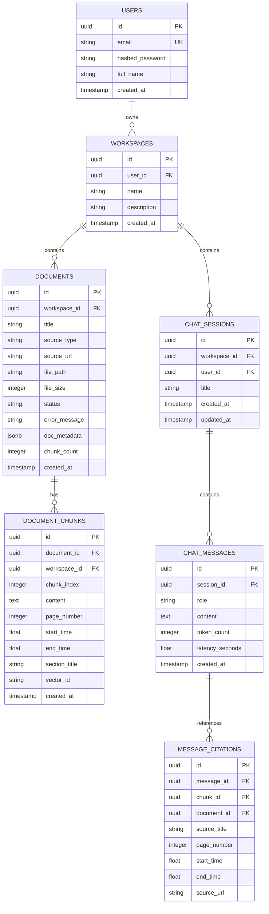

# Target Architecture Specification: Multi-Source RAG Chatbot Platform

**Version:** 1.0.0-PROD  
**Architect:** Antigravity AI Engineering Architecture Team  
**System Vision:** "ChatGPT for your own knowledge" — A secure, scalable, multi-tenant RAG platform supporting heterogeneous document, web, and video knowledge ingestion with grounded conversational intelligence and exact source citations.

---

## 1. System Overview & Clean Architecture

The platform adopts a **Hexagonal / Clean Architecture** separating core domain logic (RAG pipeline, chunking, retrieval) from external adapters (vector stores, databases, LLMs, web interfaces).

```text
┌─────────────────────────────────────────────────────────────────────────────┐
│                            REACT 19 + VITE FRONTEND                         │
│  - Workspace / Knowledge Manager    - Drag & Drop Upload (PDF/DOCX/Web/YT)  │
│  - Interactive Source Citations     - SSE Real-time Streaming Chat          │
│  - Dark / Light Theme System        - Ingestion Status Tracker              │
└──────────────────────────────────────┬──────────────────────────────────────┘
                                       │ HTTP / Server-Sent Events (SSE)
                                       ▼
┌─────────────────────────────────────────────────────────────────────────────┐
│                          FASTAPI APPLICATION LAYER                          │
│  - Authentication & RBAC Middleware  - Rate Limiting & SSRF Validator       │
│  - Pydantic v2 DTOs & Validation    - Background Tasks / Ingestion Queue    │
│  - API Versioning (/api/v1)          - Structured Logging & Observability   │
├──────────────────────────────────────┬──────────────────────────────────────┤
│                             SERVICE LAYER                                   │
│  ├── IngestionService    ├── RAGService       ├── ChatSessionService        │
│  ├── DocumentService     ├── EvaluatorService └── WorkspaceService          │
├──────────────────────────────────────┼──────────────────────────────────────┤
│                         DOMAIN & ADAPTER LAYER                              │
│                                                                             │
│  ┌───────────────────────┐ ┌───────────────────────┐ ┌────────────────────┐ │
│  │   Document Loaders    │ │  Embedding Providers  │ │   LLM Providers    │ │
│  │  - BaseLoader (ABC)   │ │  - BaseEmbedder (ABC) │ │  - BaseLLM (ABC)   │ │
│  │  - PDFLoader (PyMuPDF)│ │  - HuggingFaceLocal   │ │  - GroqProvider    │ │
│  │  - WebLoader (Trafil) │ │  - OpenAIEmbedder     │ │  - OpenAIProvider  │ │
│  │  - YouTubeLoader (API)│ │  - OllamaEmbedder     │ │  - OllamaProvider  │ │
│  │  - OfficeLoader (DOCX)│ └───────────────────────┘ └────────────────────┘ │
│  │  - DataLoaders (CSV)  │ ┌───────────────────────┐ ┌────────────────────┐ │
│  │  - Markdown / TXT     │ │     Vector Stores     │ │  Relational DB     │ │
│  └───────────────────────┘ │  - BaseVectorStore    │ │  - SQLAlchemy 2.0  │ │
│                            │  - FAISS Store (Disk) │ │  - Postgres/SQLite │ │
│                            │  - Qdrant / PGVector  │ │  - Alembic Migr.   │ │
│                            └───────────────────────┘ └────────────────────┘ │
└─────────────────────────────────────────────────────────────────────────────┘
```

---

## 2. Ingestion Pipeline & Adapter Pattern

Adding new sources requires only subclassing `BaseLoader` without touching the pipeline engine.

```text
Source Input (File / URL / Video)
       │
       ▼
Source Classifier & SSRF Validator
       │
       ▼
BaseLoader Implementation
 ├── PDFLoader (PyMuPDF / pypdf): Extracts text, preserves page numbers, tables, headings.
 ├── WebLoader (Trafilatura / BeautifulSoup): Cleans boilerplate, navigations, extracts headings.
 ├── YouTubeLoader (youtube-transcript-api): Pulls transcript segments with start/end timestamps.
 ├── OfficeLoader (python-docx / openpyxl): DOCX, CSV, XLSX structured rows.
 └── TextLoader: TXT, Markdown with frontmatter parsing.
       │
       ▼
Content Cleaner & Normalizer (strips null bytes, normalizes unicode, removes boilerplate)
       │
       ▼
Configurable Chunker (Token-aware recursive splitting with structural metadata preservation)
       │
       ▼
Metadata Enrichment (workspace_id, doc_id, chunk_id, page_no, timestamp_span, url, title)
       │
       ▼
Embedding Generation (Batch embedding via EmbeddingProvider)
       │
       ▼
Vector Index Persistence + SQL Document Registry Update
```

---

## 3. High-Precision Grounded RAG Pipeline

```text
User Question + Conversation History (Last N turns)
                        │
                        ▼
           Conversational Query Rewriter
 (De-references pronouns, generates standalone semantic search query)
                        │
                        ▼
            Hybrid / Dense Retriever
 (Queries VectorStore with workspace_id metadata filter; retrieves top-k candidates)
                        │
                        ▼
             Context Reranking & Filter
 (Optional cross-encoder / relevance score filtering to eliminate noise)
                        │
                        ▼
               Grounding Prompt Builder
 (Formats numbered reference chunks with strict system constraints against hallucination)
                        │
                        ▼
                 LLM Streaming Engine
 (Generates grounded answer + structured citations stream via SSE)
                        │
                        ▼
       Client Response + Interactive Source Badges
 (Rendered with page numbers, timestamps, direct source links)
```

---

## 4. Relational Database Schema (SQLAlchemy / PostgreSQL / SQLite)



---

## 5. Technology Choices & Justification

| Layer | Selected Tech | Justification |
| :--- | :--- | :--- |
| **Backend Framework** | **FastAPI (Python 3.11+)** | High performance asynchronous endpoints, native Pydantic v2 data validation, OpenAPI interactive docs, first-class SSE streaming support. |
| **ORM & Database** | **SQLAlchemy 2.0 (Async) + PostgreSQL / SQLite** | Production-ready transactional persistence with transparent migration between SQLite (lightweight local dev/tests) and PostgreSQL (production). |
| **Vector Store** | **FAISS with Disk Serialization + Modular Abstraction** | Extremely fast in-process vector retrieval without mandatory external cluster overhead initially, encapsulated behind `BaseVectorStore` for instant Qdrant/pgvector swapping. |
| **LLM Inference** | **ChatGroq (`llama-3.3-70b-versatile`) + OpenAI fallback** | Sub-second token time-to-first-token (TTFT), industry-leading reasoning performance on RAG synthesis, flexible adapter switch. |
| **Embeddings** | **HuggingFace (`all-MiniLM-L6-v2`) + OpenAI / FastEmbed** | High performance semantic density, zero external API costs for local embedding, pluggable via `BaseEmbedder`. |
| **Frontend Framework** | **React 19 + Vite + TypeScript** | Blazing fast build tooling, robust type safety, component modularity, instant HMR. |
| **Frontend Styling** | **Tailwind CSS + Lucide Icons** | Polished, accessible, modern SaaS visual hierarchy supporting Dark and Light themes seamlessly. |
| **Document Parsers** | **PyMuPDF, python-docx, Trafilatura, youtube-transcript-api** | Clean, fast extraction of text, metadata, page numbers, and video timestamps. |
| **Testing & Eval** | **pytest, pytest-asyncio, Ragas / custom metrics** | Ground truth evaluation for retrieval recall, context precision, and hallucination scoring. |
| **Containerization** | **Docker & Docker Compose** | Reproducible multi-service deployment orchestrating Frontend, Backend, PostgreSQL, and Redis. |

---

## 6. Target Directory Structure

```text
youtube-website-rag-chatbot/
├── backend/
│   ├── app/
│   │   ├── api/
│   │   │   └── v1/
│   │   │       ├── auth.py
│   │   │       ├── workspaces.py
│   │   │       ├── documents.py
│   │   │       ├── chat.py
│   │   │       ├── evaluation.py
│   │   │       └── health.py
│   │   ├── core/
│   │   │   ├── config.py             # Pydantic Settings
│   │   │   ├── database.py           # Async SQLAlchemy Engine
│   │   │   ├── security.py           # JWT & SSRF Validator
│   │   │   └── logging.py            # Structured JSON logger
│   │   ├── models/                   # SQLAlchemy ORM Models
│   │   │   ├── user.py
│   │   │   ├── workspace.py
│   │   │   ├── document.py
│   │   │   └── chat.py
│   │   ├── schemas/                  # Pydantic Request/Response Models
│   │   │   ├── workspace.py
│   │   │   ├── document.py
│   │   │   ├── chat.py
│   │   │   └── evaluation.py
│   │   ├── services/
│   │   │   ├── rag/
│   │   │   │   ├── engine.py         # Complete RAG Orchestrator
│   │   │   │   ├── query_rewriter.py # Conversational query reformulator
│   │   │   │   ├── retriever.py      # Semantic & hybrid search
│   │   │   │   ├── reranker.py       # Score filtering / reranker
│   │   │   │   └── prompts.py        # Strict grounding prompts
│   │   │   ├── ingestion/
│   │   │   │   ├── pipeline.py       # Async document ingestion flow
│   │   │   │   ├── chunker.py        # Semantic / recursive chunkers
│   │   │   │   └── loaders/
│   │   │   │       ├── base.py
│   │   │   │       ├── pdf_loader.py
│   │   │   │       ├── web_loader.py
│   │   │   │       ├── youtube_loader.py
│   │   │   │       ├── docx_loader.py
│   │   │   │       ├── text_loader.py
│   │   │   │       └── data_loader.py # CSV / XLSX
│   │   │   ├── embeddings/
│   │   │   │   ├── base.py
│   │   │   │   ├── huggingface.py
│   │   │   │   └── openai.py
│   │   │   ├── vector_store/
│   │   │   │   ├── base.py
│   │   │   │   └── faiss_store.py    # Persistent FAISS with disk index
│   │   │   ├── llm/
│   │   │   │   ├── base.py
│   │   │   │   ├── groq_provider.py
│   │   │   │   └── openai_provider.py
│   │   │   └── chat_service.py
│   │   └── main.py                   # FastAPI Application Entry
│   ├── tests/
│   │   ├── unit/
│   │   ├── integration/
│   │   └── evaluation/
│   ├── requirements.txt
│   └── Dockerfile
├── frontend/
│   ├── src/
│   │   ├── components/
│   │   │   ├── layout/               # Header, Sidebar, WorkspaceSelector
│   │   │   ├── chat/                 # ChatBox, MessageList, CitationCard, TokenStream
│   │   │   ├── documents/            # DocumentTable, UploadModal, IngestionStatus
│   │   │   └── ui/                   # Button, Input, Modal, Badge, Switch, Spinner
│   │   ├── hooks/                    # useChat, useDocuments, useWorkspaces, useTheme
│   │   ├── services/                 # api.ts, sseClient.ts
│   │   ├── types/                    # TypeScript interfaces
│   │   ├── App.tsx
│   │   └── main.tsx
│   ├── package.json
│   ├── tailwind.config.js
│   ├── tsconfig.json
│   └── vite.config.ts
├── docs/
│   ├── architecture.md
│   ├── rag-pipeline.md
│   ├── ingestion.md
│   ├── api.md
│   └── evaluation.md
├── docker-compose.yml
├── .env.example
├── PROJECT_AUDIT.md
├── TARGET_ARCHITECTURE.md
└── README.md
```
